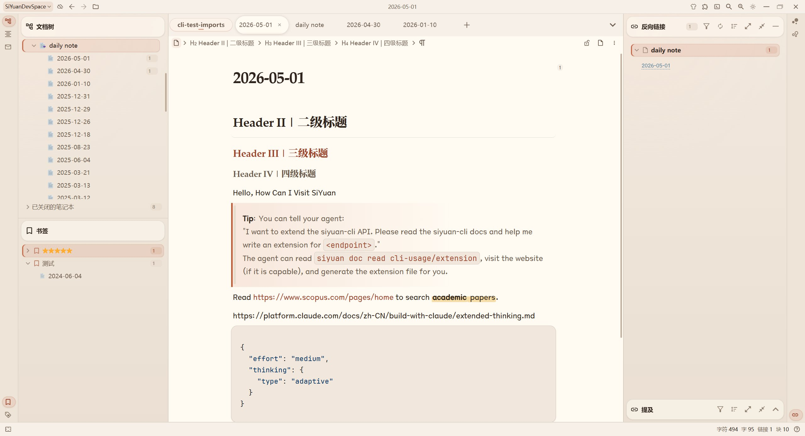

# Siyaude

A SiYuan theme inspired by Claude.

Siyaude brings a warm, quiet, reading-focused interface to SiYuan, with both light and dark modes.

## Features

- Light and dark mode
- Warm sand-toned palette
- Refined editor typography
- Polished document tree, tabs, backlinks, bookmarks, and panels
- Gentle hover states for focused writing

## Disclaimer

This project is inspired by Claude’s interface aesthetics.

It is not affiliated with, endorsed by, or sponsored by Anthropic or Claude.

## License

MIT
